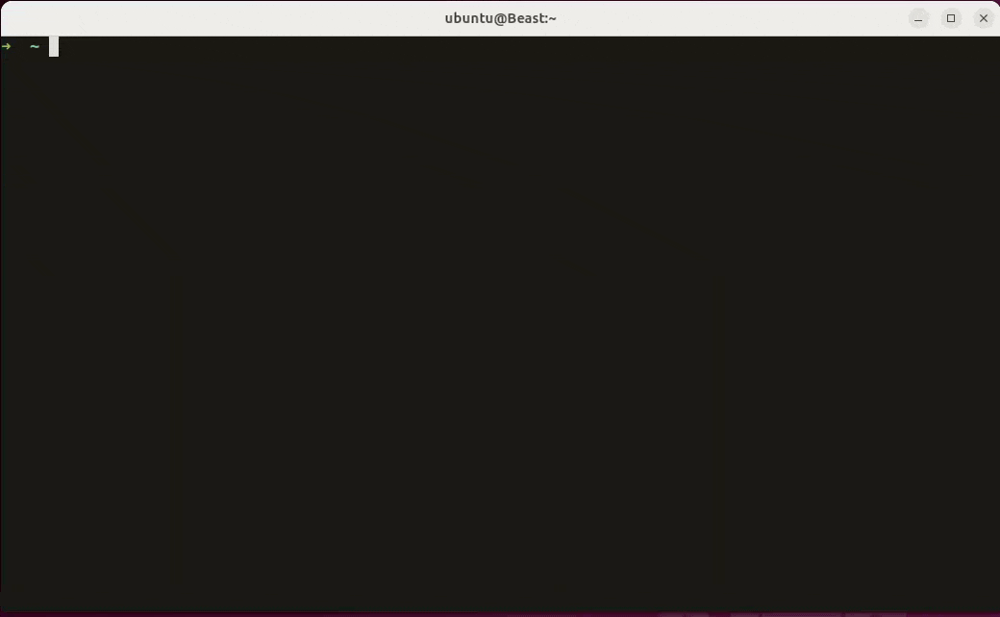
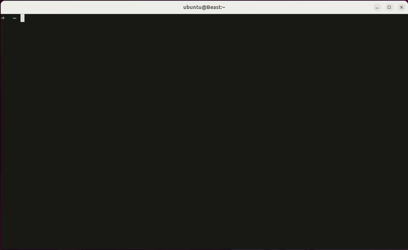
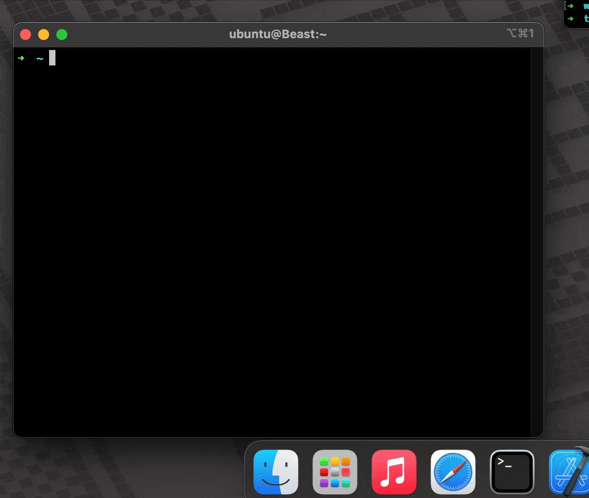
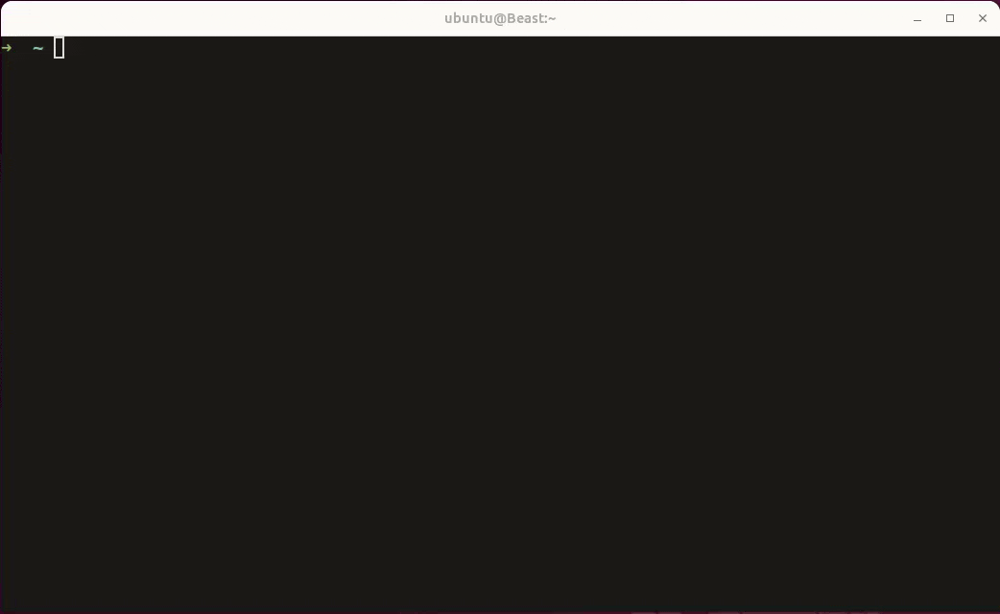
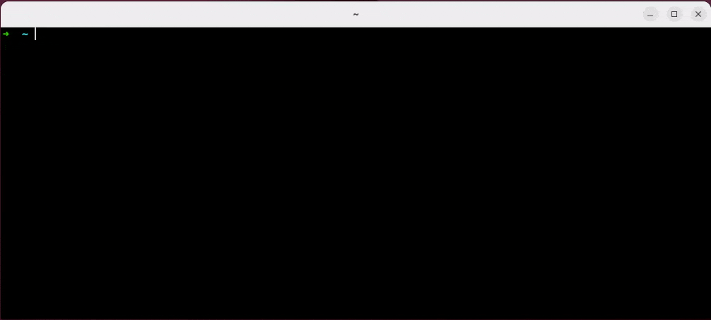
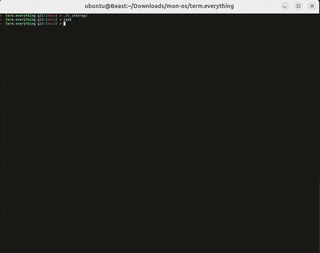

<table>
  <tr>
    <td valign="middle">
      
    </td>
    <td><h1>Term.Everything❗</h1></td>
    <td><a href="https://github.com/mmulet/term.everything/releases">Download the beta test now!</a></td>
    <td><a href="./resources/HowIDidIt.md">HowIDidIt.md</a></td>
  </tr>
  <tr>
    <td></td>
    <td>Works on both x11 and Wayland host systems.</td>
    <td></td>
    <td></td>
  </tr>
</table>

## Run every GUI app in the terminal!

## Even over ssh!
Behold as I play a [video game in a font](https://github.com/mmulet/font-game-engine) in a web browser in a terminal transmitted over ssh (with one hand tied behind my back)!

### Read about how it works!
Check out [HowIDidIt.md](./resources/HowIDidIt.md)

## More Examples
The quality of the window is limited to the number of rows and columns in your
terminal. If you increase the resolution (ctrl - in alacritty, check your
terminal) the quality will go up, (but performance may go down).

Here I open up the Wing It! movie, and increase the quality until I get both
a good frame rate and resolution:

----------------

If your terminal supports images (like [kitty](https://sw.kovidgoyal.net/kitty/)
or [iterm2](https://iterm2.com/)) you can render windows at full resolution
(performance may degrade).

In this example, on my mac, I open iTerm2 ssh into ubuntu and open firefox
at full resolution:

------------

I feel like every single day I hear about another terminal file viewer. I say, stop making terminal file viewers because you can just use the file viewer you already have! In your terminal!

-------------

Terminal in a terminal in a terminal in a terminal in a terminal.... it's terminals all the way down.

-------------
With only a small amount hacking, it can run Doom (shareware episode)!

------
Run an entire Desktop in your terminal!
[@ismail-yilmaz](https://github.com/ismail-yilmaz) is running Firefox, on [KDE Neon](https://neon.kde.org) in a [VM](https://gitlab.gnome.org/GNOME/gnome-boxes) on [Bobcat](https://github.com/ismail-yilmaz/Bobcat)

And this isn't even full resolution! Checkout the [full vid in in the discussions](https://github.com/mmulet/term.everything/discussions/16#discussioncomment-14390137)

## About
`term.everything❗` is a Linux CLI program to run GUI windows in your terminal. Specifically, `term.everything❗` is a built-from-scratch [Wayland](https://wiki.archlinux.org/title/Wayland) compositor that outputs to a terminal rather than your monitor.

>Don't know what Wayland is or just want to know more about how this works? Then, head over to [HowIDidIt.md](./resources/HowIDidIt.md) where I will explain how everything works in detail.

## Try it out!
[Download the beta test now!](https://github.com/mmulet/term.everything/releases)

## Roadmap
1. [x] Term some things <--- This is where we are at
  - Some apps or (even most apps) may fail to launch or even crash! Please create [an issue]( https://github.com/mmulet/term.everything/issues) if you have problems.
2. [ ] Term most things
3. [ ] Term everything❗

## Help and Usage
Check out the [help file here](./resources/help.md) for a usage guide on how to use `term.everything❗`

## Contributing
term.everything❗ is written in developer friendly [Typescript](https://www.typescriptlang.org/) using the [bun](https://bun.com/) engine, with a just a smidge of C++.
See [./Contributing.md](./Contributing.md).

## Legal:

term.everything❗ copyright 2025 Late for Dinner Studios, LLC
---
Fontemon copyright 2021 Late for Dinner Studios, LLC
---
Wing It! movie is licensed under the Creative Commons Attribution 4.0 license
[Wing it licensing page](https://studio.blender.org/projects/wing-it/pages/licensing/)
Attribution:
(CC) Blender Foundation | studio.blender.org
---
Doom shareware episode is copyright 1993 id Software
---

## Bonus:
This is Gwerm the Term Worm.

He is doing okay. Thanks for asking.
